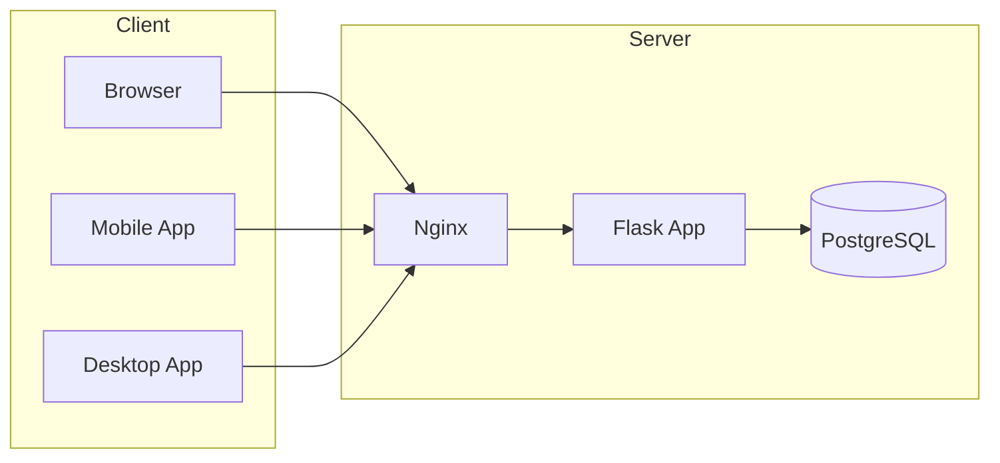
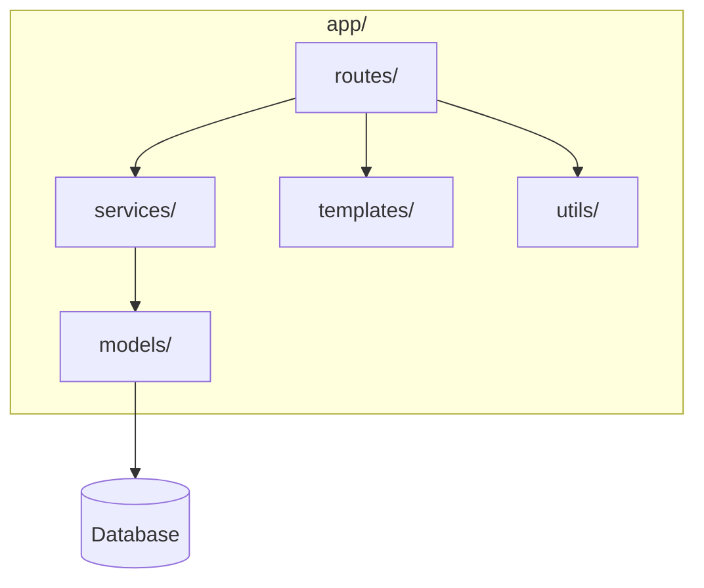

# TimeTracker Architecture

This document gives a high-level overview of the TimeTracker system for contributors and maintainers. For folder-level detail, see [Project Structure](docs/development/PROJECT_STRUCTURE.md). For migrating code to the service layer, see [Architecture Migration Guide](docs/implementation-notes/ARCHITECTURE_MIGRATION_GUIDE.md).

## System Overview

TimeTracker is a self-hosted web application for time tracking, project management, invoicing, and reporting. The core is a **Flask** app serving both HTML (server-rendered) and a **REST API**. Optional components include background jobs (APScheduler), real-time updates (WebSocket via Flask-SocketIO), and monitoring (Prometheus, Sentry, PostHog). Telemetry is two-layer: **base telemetry** (always-on, minimal: install footprint, version, platform, heartbeat) and **detailed analytics** (opt-in only: feature usage, screens, errors). See [Telemetry Architecture](telemetry-architecture.md). Deployment is typically **Docker** with Nginx as reverse proxy and PostgreSQL as the primary database.

## Main Modules

| Layer | Location | Role |
|-------|----------|------|
| Entry point | `app.py` | Creates Flask app, loads config, registers blueprints via `blueprint_registry`, starts server (and optional SocketIO/scheduler). |
| Blueprint registry | `app/blueprint_registry.py` | Single place that imports and registers all route blueprints so `app/__init__.py` stays manageable. Optional blueprints and the optional `audit_logs` module log failures at **ERROR** with a full traceback (`logger.exception`); in **`FLASK_ENV=development`** or **`DEBUG`**, registration failures **re-raise** so misconfiguration fails fast. In **production** and **testing**, optional blueprint import failures are logged and skipped so the app still starts. |
| Routes | `app/routes/` | HTTP handlers: auth, main (dashboard), projects, timer, reports, admin, api, api_v1 (plus api_v1_* sub-blueprints), tasks, issues, invoices, clients, etc. |
| Services | `app/services/` | Business logic; routes call services instead of putting logic in view code. |
| Repositories | `app/repositories/` | Data access layer; services and routes use repositories for queries and eager loading. |
| Models | `app/models/` | SQLAlchemy ORM models (users, projects, time entries, tasks, clients, etc.). |
| Schemas | `app/schemas/` | Marshmallow schemas for API request/response validation and serialization. |
| Templates | `app/templates/` | Jinja2 HTML templates for server-rendered pages. |
| Utils | `app/utils/` | Helpers: timezone, validation, API responses, auth, setup_logging, legacy_migrations. |
| Config | `app/config.py` | Application configuration (env-based). |
| Desktop | `desktop/` | Electron-style desktop app (esbuild bundle) that talks to the API. |
| Mobile | `mobile/` | Flutter mobile app (iOS/Android) using the REST API. |
| Docker | `docker/`, root `Dockerfile` | Container build and runtime; optional Nginx, DB init scripts. |
| Tests | `tests/` | Pytest-based test suite (test_routes, test_services, test_models, test_utils, test_integration). |

## Data Flow

- **Web request:** User or browser → Nginx (if used) → Flask → blueprint in `app/routes/` → optional **service** in `app/services/` → **repositories** / **models** and DB → response (HTML or JSON).
- **API request:** Same path; API blueprints return JSON and use token auth. Request → route → service (or repository) → model/DB → `api_responses` helpers → JSON.
- **Real-time:** Flask-SocketIO is used for live timer updates; clients connect over WebSocket and receive events from the server.
- **Background:** APScheduler runs periodic tasks (e.g. scheduled reports, weekly summaries, remind-to-log end-of-day emails, reminders, cleanup) inside the app process. Report exports include time-entries PDF and summary-report PDF ([app/utils/summary_report_pdf.py](app/utils/summary_report_pdf.py)).

API endpoints are versioned under `/api/v1/`. Authentication is session-based for the web UI and API-token (Bearer or `X-API-Key`) for the API.

## API Structure

- **Integrations (primary):** **`/api/v1/`** — Versioned REST API for desktop, mobile, and automation. **API token** auth (`Authorization: Bearer <token>` or `X-API-Key: <token>`). Tokens are created in Admin → Api-tokens and have scopes (e.g. `read:projects`, `write:time_entries`). Documented in OpenAPI at `/api/docs` (spec: `/api/openapi.json`).
- **Web UI JSON (session):** **`/api/*`** (see [`app/routes/api.py`](../app/routes/api.py)) — Same-origin JSON used by the logged-in browser (Flask-Login session cookie): command-palette search, timer helpers, notifications, dashboard fragments (including **`GET /api/reports/week-comparison`** for the week-vs-week chart), calendar helpers, uploads, time entry updates (**`PUT`/`PATCH /api/entry/<id>`** for inline edits and similar), and related helpers. **Not** the integration contract; paths may evolve with the UI. Where a v1 equivalent exists, responses may include **`X-API-Deprecated: true`** and a **`Link: <.../api/v1/...>; rel="successor-version"`** header.
- **Sub-blueprints (all under `/api/v1/`):** `api_v1` (info, health, auth/login), `api_v1_time_entries`, `api_v1_projects`, `api_v1_tasks`, `api_v1_clients`, `api_v1_invoices`, `api_v1_expenses`, `api_v1_payments`, `api_v1_mileage`, `api_v1_deals`, `api_v1_leads`, `api_v1_contacts`, plus remaining routes in `api_v1` (time-entry-approvals, per-diems, budget-alerts, calendar, kanban, saved-filters, etc.).
- **Full reference:** [REST API](api/REST_API.md).

## Backend vs Frontend

- **Backend:** Flask (Python), Jinja2, SQLAlchemy, Flask-Migrate, Flask-Login, Authlib (OIDC), Flask-SocketIO, APScheduler. Configuration via environment variables (see `env.example`).
- **Frontend:** Server-rendered HTML from Jinja2, styled with **Tailwind CSS**. JavaScript is used for interactivity (e.g. Chart.js, command palette, forms). The app can be used as a **PWA** (offline and installable). There is no separate SPA; the main UI is server-rendered with JS enhancements.
- **UI layer:** The base layout is `app/templates/base.html` (sidebar, header, main content area). Styling uses **Tailwind** and design tokens in `app/static/src/input.css`. Reusable UI is built from **component macros** in `app/templates/components/ui.html` and `app/templates/components/cards.html` (page headers, stat cards, empty states, modals, buttons). Layout uses a max-width content container and consistent grid and spacing. See [UI Guidelines](UI_GUIDELINES.md) and [Project Structure](development/PROJECT_STRUCTURE.md) for templates and static assets.
- **Native clients:** The **desktop** (Electron) and **mobile** (Flutter) apps are separate codebases that consume the REST API.

## Design Decisions

- **Service layer:** Business logic lives in `app/services/` so routes stay thin and logic is reusable and testable. See [Service Layer and Base CRUD](development/SERVICE_LAYER_AND_BASE_CRUD.md) and the [Architecture Migration Guide](implementation-notes/ARCHITECTURE_MIGRATION_GUIDE.md).
- **API v1 split:** Core resources (projects, tasks, clients, invoices, expenses, payments, mileage, deals, leads, contacts) are in separate sub-blueprints (`api_v1_*.py`) under `/api/v1/` for maintainability; the main `api_v1` module keeps info, health, auth, and remaining endpoints.
- **Bootstrap:** Logging is configured in `app/utils/setup_logging.py`; legacy migration helpers (task management, issues tables) are in `app/utils/legacy_migrations.py`. `app/__init__.py` creates the app and wires extensions.
- **Blueprint registry:** All blueprints are registered from `app/blueprint_registry.py` to keep registration in one place and simplify adding new modules. Optional modules log registration errors with tracebacks; development mode re-raises to surface broken optional routes early.
- **Database:** **PostgreSQL** is recommended for production; **SQLite** is supported for development and testing (e.g. `docker/docker-compose.local-test.yml`).
- **API auth:** The REST API uses API tokens (created in Admin → Api-tokens) with scopes; no session cookies for API access.
- **Single codebase for web UI:** No separate frontend repo; templates and static assets live in the main repo under `app/templates/` and `app/static/`.

## Further Reading

- [Project Structure](development/PROJECT_STRUCTURE.md) — Folder layout and file roles
- [Architecture Migration Guide](implementation-notes/ARCHITECTURE_MIGRATION_GUIDE.md) — Moving routes to the service layer
- [REST API](api/REST_API.md) — API reference and authentication
