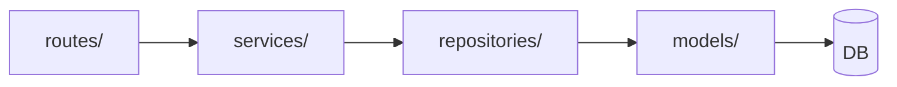

# Contributor Guide

Single-page overview for contributors: architecture, local dev, testing, how to add routes/services/templates, and versioning. For full guidelines see [CONTRIBUTING.md](CONTRIBUTING.md); for structure see [Project Structure](PROJECT_STRUCTURE.md).

---

## Repo architecture

- **Stack**: Flask app (server-rendered HTML + REST API), optional SocketIO/scheduler, Docker + Nginx + PostgreSQL.
- **Layers**: Routes (`app/routes/`) → Services (`app/services/`) → Repositories (`app/repositories/`) / Models (`app/models/`). API under `/api/v1/`.
- **Blueprint registration**: All route blueprints are registered in `app/blueprint_registry.py` (single place). Use the main registration list for required modules; optional feature blueprints go in `_register_optional_blueprints`—failures are logged with a full traceback, and the process re-raises in **development** only so optional routes are not silently missing locally.

**More**: [ARCHITECTURE.md](../ARCHITECTURE.md) · [Project Structure](PROJECT_STRUCTURE.md)

---

## Local dev workflow

1. **Clone** the repo and `cd TimeTracker`.
2. **Venv**: `python -m venv venv` then activate (`venv\Scripts\activate` on Windows, `source venv/bin/activate` on Linux/macOS).
3. **Deps**: `pip install -r requirements.txt`; for tests also `pip install -r requirements-test.txt`.
4. **Env**: `cp env.example .env` and set at least `SECRET_KEY` (e.g. `python -c "import secrets; print(secrets.token_hex(32))"`).
5. **DB**: `flask db upgrade`.
6. **Run**: `flask run` → http://127.0.0.1:5000.

**Docker (no local Python)**:
- **SQLite (quick test)**: `docker-compose -f docker/docker-compose.local-test.yml up --build` → http://localhost:8080.
- **Default (HTTPS)**: `docker-compose up -d` → https://localhost (self-signed cert).
- **HTTP 8080**: `docker-compose -f docker-compose.example.yml up -d` → http://localhost:8080.

**More**: [Local Testing with SQLite](LOCAL_TESTING_WITH_SQLITE.md) · [DEVELOPMENT.md](../DEVELOPMENT.md)

---

## Testing workflow

- **Full suite**: `pytest` or `make test`.
- **Coverage (required for CI)**: `make test-coverage` or `pytest --cov=app --cov-report=html --cov-fail-under=50`.
- **By type**: `make test-routes`, `make test-models`, `make test-api`, `make test-unit`, `make test-integration`, `make test-smoke`.
- **Markers**: `pytest -m routes`, `pytest -m api`, etc.

Run the full test suite before opening a PR. Add tests for new behavior (e.g. in `tests/test_routes/`, `tests/test_services/`, `tests/test_api_*`).

**More**: [Testing Quick Reference](../TESTING_QUICK_REFERENCE.md) · [Testing Coverage Guide](../TESTING_COVERAGE_GUIDE.md)

---

## How to add a route

1. Add or extend a blueprint in `app/routes/` (e.g. new file or existing `api_v1_*.py`).
2. **Register** the blueprint in `app/blueprint_registry.py` (import and `app.register_blueprint(...)` in `register_all_blueprints`, or add an optional `(module_path, bp_attr)` tuple if the module may be absent in some installs).
3. Prefer calling a **service** for business logic; keep the route thin.
4. Add tests in `tests/test_routes/` or `tests/test_api_*` as appropriate.

**More**: [Service Layer and Base CRUD](SERVICE_LAYER_AND_BASE_CRUD.md) · [CONTRIBUTING.md](CONTRIBUTING.md)

---

## How to add a service or repository

1. **Service**: Add a class in `app/services/` (e.g. `app/services/my_domain_service.py`). Put business logic and orchestration here.
2. **Repository** (optional): Add a class in `app/repositories/` for data access and shared queries; use it from the service or route.
3. Follow existing patterns (see [Service Layer and Base CRUD](SERVICE_LAYER_AND_BASE_CRUD.md)); use `BaseCRUDService` only when the domain is simple CRUD with an existing repository.
4. Call the service from routes; add tests in `tests/test_services/` or `tests/test_repositories/`.

**More**: [SERVICE_LAYER_AND_BASE_CRUD.md](SERVICE_LAYER_AND_BASE_CRUD.md) · [ARCHITECTURE.md](../ARCHITECTURE.md)

---

## How to add a template

1. Create a template that extends `app/templates/base.html` and overrides blocks (`content`, `title`, etc.).
2. Use components from `app/templates/components/ui.html` (e.g. `page_header`, `empty_state`, `modal`, `confirm_dialog`, form macros). Prefer these over legacy `_components.html`.
3. Follow [UI Guidelines](../UI_GUIDELINES.md) and [FRONTEND.md](../FRONTEND.md) for layout, buttons, and accessibility.
4. Styles: Tailwind; edit `app/static/src/input.css` and build to `app/static/dist/output.css` if needed.

---

## Versioning

- **Application version**: Defined **only** in `setup.py`. Do not duplicate it in README or other docs.
- **Desktop / mobile**: Desktop and mobile builds may use their own version numbers; see [BUILD.md](../build/BUILD.md) and repo scripts. Align with app version when releasing together.
- **Releases and Docker images**: Tagging, GitHub releases, and image publishing are in [VERSION_MANAGEMENT.md](../admin/deployment/VERSION_MANAGEMENT.md) and [RELEASE_PROCESS.md](../admin/deployment/RELEASE_PROCESS.md).

**For contributors**: When updating the app version, change only `setup.py`. Do not add the version number to README, FEATURES_COMPLETE, or PROJECT_STRUCTURE.
